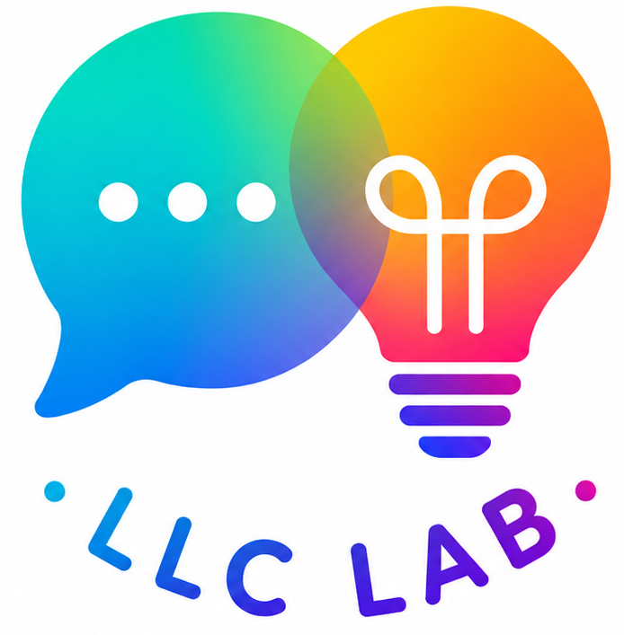

:::: {.home-shell}

::: {.welcome-panel}

::: {.home-logo}
{fig-alt="LLC Lab logo"}
:::

### Welcome to the Language, Learning & Cognition Lab!

We study how our minds absorb huge amounts of knowledge just from everyday life, such as how we learn words and concepts just from having conversations and looking at the world around us. We're especially interested in how this learning is shaped by the ways our minds grow and change across childhood and into adulthood.

:::

::: {.pathways-panel}

<!--
Interested in taking part in our research? [Learn about participating →](participate.qmd)
-->

We are currently welcoming prospective graduate students and research assistants! [Find out about joining the lab](join.qmd).

Want to see what we study? Explore our [Research](research.qmd) and [Publications](publications.qmd).

:::

::::