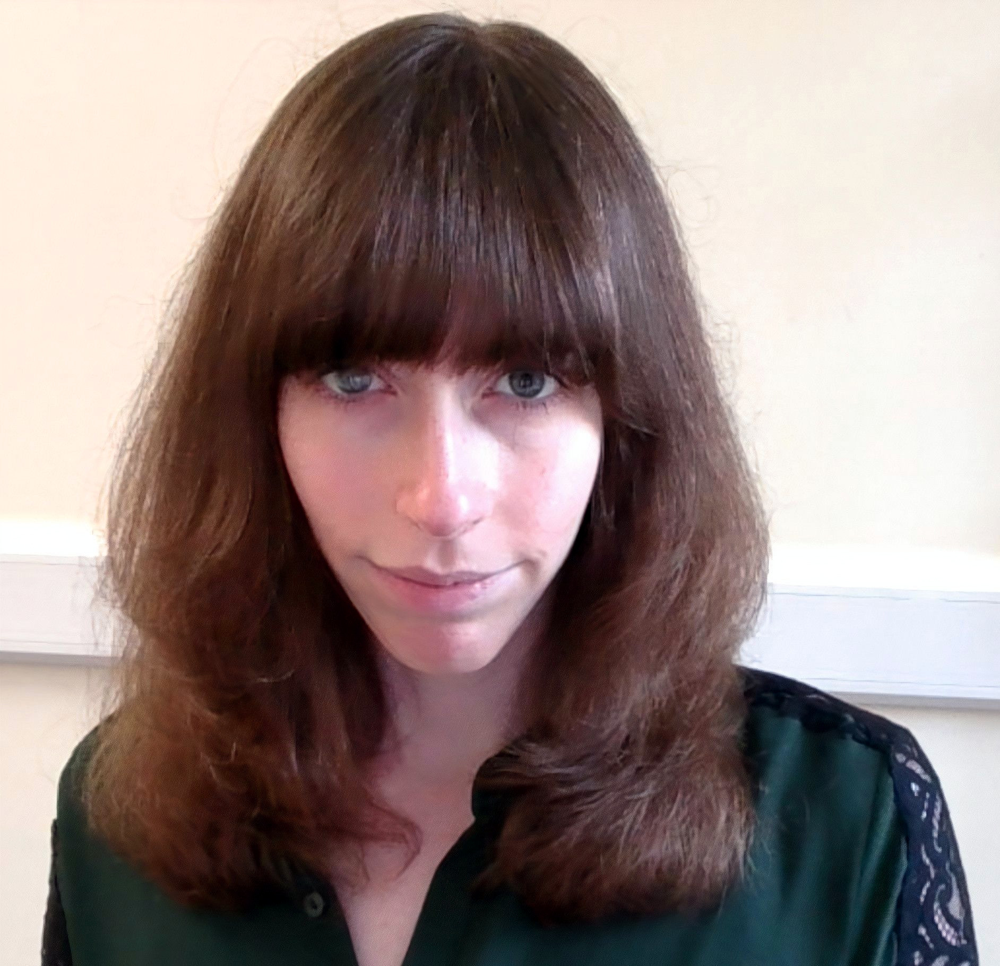

:::: {.people-page}

::: {.person-card .pi-card}

::: {.person-photo}

:::

::: {.person-info}

### Dr. Layla Unger

she/her

Layla directs the lab and is an Assistant Professor in the Department of Psychological & Brain Sciences at the University of Louisville. 

She completed her PhD at Carnegie Mellon University and postdoctoral training at The Ohio State University. Her research focuses on how we develop rich, interconnected bodies of knowledge about the world that support our abilities to use language, reason, retrieve useful knowledge from memory, learn new things, and many other fundamental aspects of human intelligence. She pursues these questions using a combination of behavioral experiments, eye tracking, Natural Language Processing (NLP), and computational modeling.

<a href="assets/cv/unger_cv.pdf" target="_blank">CV</a>

|

<a href="https://scholar.google.com/citations?hl=en&user=kI9oF1cAAAAJ&view_op=list_works&sortby=pubdate"
   target="_blank"
   aria-label="Google Scholar"
   title="Google Scholar">
  <i class="ai ai-google-scholar"></i>
</a>

|

<a href="https://github.com/laylaunger"
   target="_blank"
   aria-label="GitHub"
   title="GitHub">
  <i class="fa-brands fa-github"></i>
</a>

:::

:::

<!--

## Graduate Students

::: {.person-card}

::: {.person-photo}
{fig-alt="Graduate student"}
:::

::: {.person-info}

### Student Name

*she/her*

Student bio goes here. This can describe their program, research interests, current projects, and anything else useful to prospective students or families visiting the site.

**Email:** student@louisville.edu

:::

:::

::: {.person-card}

::: {.person-photo}
{fig-alt="Graduate student"}
:::

::: {.person-info}

### Student Name

*they/them*

Student bio goes here.

**Email:** student@louisville.edu

:::

:::

## Undergraduate Research Assistants

::: {.person-card}

::: {.person-photo}
{fig-alt="Undergraduate research assistant"}
:::

::: {.person-info}

### Student Name

*she/her*

Psychology major interested in language development and learning.

:::

:::

-->

::::