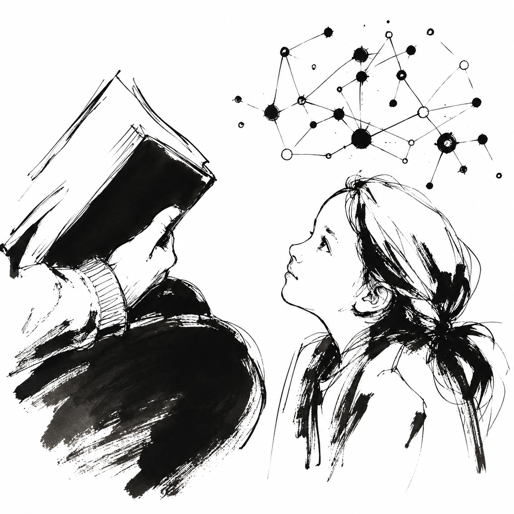
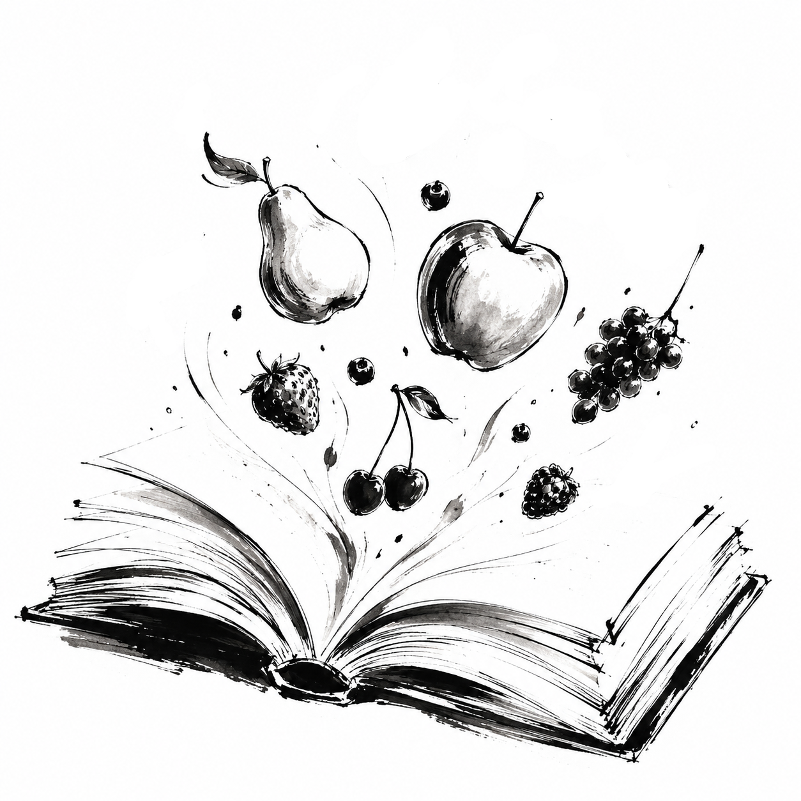
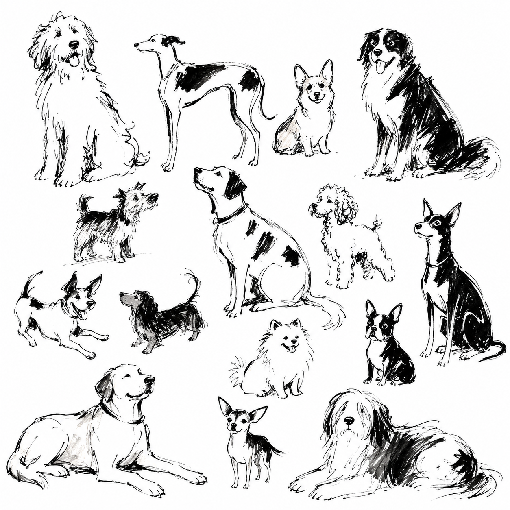

::::: {.research-page}

:::: {.research-topic}

::: {.research-copy}

## Learning from Language

We somehow go from nonverbal infants to adults who can easily use and understand thousands of words. Our knowledge of words is not just a bunch of separate definitions, but a richly interconnected network. For example, we know that "apples" are "juicy", something we can "eat", and similar to "oranges". A potentially powerful source of this knowledge is regularities in the way words tend to occur with other words. Our research explores the nature of the cognitive mechanisms that allow us to pick up on these regularities, how these mechanisms change across development, and the contributing roles of other processes such as prediction and working memory.

:::

::: {.research-image}

:::

::::

:::: {.research-topic}

::: {.research-copy}

## Words in Context

Any one word that we hear or read is typically surrounded by many other words, such as in a broader conversation, story or book. These contexts may fundamentally shape our understanding of what words mean. For example, the other words accompanying "rambutan" in the sentence "I'd love a sweet, juicy rambutan" imply that it's a fruit. We use Natural Language Processing tools to characterize the contexts surrounding words and how they shape word learning. In future, we hope to apply this work to the goal of helping children learn new words.

:::

::: {.research-image}

:::

::::

:::: {.research-topic}

::: {.research-copy}

## Learning to See Categories

Our minds simplify the vast complexity of the visual world around us into everyday categories, like *dog*, *cup* and *chair*. For example, individual dogs vary greatly in size, color, and shape, yet we quickly and easily recognize them as the same kind of thing. Our research asks how we learn to group the world into categories even when we might not be trying to learn anything, such as from occasionally seeing dogs while going about our day-to-day lives. We're especially interested in how these experiences might shape attention, e.g., by prioritizing characteristics dogs share over ones in which they vary.

:::

::: {.research-image}

:::

::::

:::::